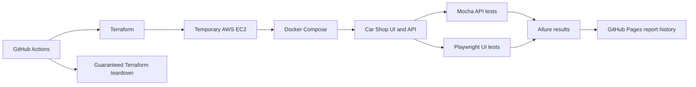

# Car Shop Test Automation

[](https://github.com/okryvorotko/test-car-shop/actions/workflows/aws-test.yml)
[](https://github.com/okryvorotko/test-car-shop/actions/workflows/ci.yml)

A personal portfolio project demonstrating a maintainable JavaScript test
automation framework for the
[Car Shop Demo](https://github.com/okryvorotko/car-shop-demo). It combines API
and browser testing, reusable test components, failure diagnostics, CI/CD,
reporting, and temporary test infrastructure. It contains no employer source
code or confidential material.

[View the published Allure report history](https://okryvorotko.github.io/test-car-shop/)

## What this project demonstrates

- REST API coverage with Node.js, Mocha, and the built-in `fetch` API
- Playwright end-to-end coverage using page objects and API-assisted setup
- Reusable API clients, test-data factories, catalog expectations, and cleanup
- Parallel browser execution with unique users and suite-level fixture reset
- One Allure report for API and UI results
- Screenshots, video, traces, browser logs, and attachments for UI failures
- GitHub Actions orchestration with report publication and retained history
- A manual Terraform workflow that provisions an ephemeral AWS EC2 environment,
  deploys the application with Docker Compose, runs the tests, and tears the
  environment down even when testing fails

## Architecture



## Run locally

### Prerequisites

- Node.js 20.19 or newer
- The [Car Shop Demo](https://github.com/okryvorotko/car-shop-demo)
  running locally
- Chromium installed through Playwright

### Setup

1. Start the demo backend at `http://localhost:4000` and frontend at
   `http://localhost:3000`.
2. Copy `.env.example` to `.env` and adjust the URLs if necessary.
3. Install the locked dependencies and Playwright browser:

```bash
npm ci
npx playwright install chromium
```

### Commands

```bash
npm run test:api
npm run test:ui
npm test
```

Configuration is read from these environment variables:

| Variable | Purpose | Example |
| --- | --- | --- |
| `API_BASE_URL` | Backend used by the API clients and test setup | `http://localhost:4000` |
| `UI_BASE_URL` | Frontend used by Playwright | `http://localhost:3000` |
| `TEST_PASSWORD` | Password assigned to generated test users | `TestPassword123!` |

The example password is test data for this local demo application and is not a
production credential.

## Test reports and diagnostics

Both Mocha API tests and Playwright UI tests write to one Allure result set.
Generate and open the report locally after running tests:

```bash
npm run report:allure
npm run report:allure:open
```

GitHub Actions publishes an indexed history of complete Allure reports to
[GitHub Pages](https://okryvorotko.github.io/test-car-shop/). Each workflow run
also retains a downloadable report artifact for seven days.

The manual workflow can optionally run one intentionally failing UI test. That
test verifies that the report includes an assertion error, screenshot, video,
Playwright trace, terminal and browser logs, and a text attachment. It is
skipped by default.

## Temporary AWS environment

The `AWS deployment tests` workflow is a manual portfolio and learning
workflow. It is intentionally separate from the fast local test commands.

At a high level it:

1. Provisions temporary infrastructure with Terraform.
2. Deploys `car-shop-demo` to EC2 with Docker Compose.
3. Restricts application access to the current GitHub runner's public IP.
4. Waits for the frontend and API health checks.
5. Runs API and UI tests on that same runner and captures their results.
6. Destroys the temporary infrastructure through an `if: always()` teardown
   path.
7. Publishes the combined report from uploaded test results.

The workflow uses a versioned S3 backend with native state locking. Before its
first run, bootstrap the state bucket and configure the `TF_STATE_BUCKET`
repository variable as described in [`terraform/README.md`](terraform/README.md).

The Terraform area is also being used for an active infrastructure curriculum.
The deployable module is stored directly under `terraform/`; curriculum and
remote-state exercises are kept in clearly named subdirectories and are not
part of the application deployment module.

## Current design boundaries

- UI tests run across two workers. A suite-level reset establishes the fixture
  baseline, while unique users and distinct mutable cars prevent worker cleanup
  from invalidating another test.
- AWS execution is manual because it creates billable infrastructure.
- The application and credentials are disposable test fixtures, not a
  production security model.
- Browser coverage currently targets Chromium; additional browser projects can
  be added without changing the page objects or test flows.

These constraints are explicit so the repository shows intentional engineering
trade-offs rather than implying production scale that the demo does not have.

## Project layout

```text
.github/workflows  CI/CD workflows
scripts            Report-history generation
src/api            API clients and cleanup helpers
src/data           Reusable catalog expectations
src/fixtures       User and test-data factories
src/ui             Playwright page objects
terraform          Deployable module and isolated curriculum exercises
tests/api          Mocha API specs
tests/ui           Playwright UI specs and opt-in diagnostics demo
```

## License

This project is available under the [MIT License](LICENSE).
